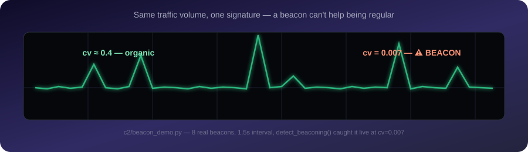

<div align="center">

# 🎯 Vantage SOC Toolkit

[](https://github.com/ArnavGarg2006/vantage-soc-toolkit)


A portfolio of Python security tooling organized around the **MITRE ATT&CK** (offensive
tactics) and **MITRE Shield** (defensive tactics) frameworks — inspired by the structure
of Howard Poston's [Python for Cybersecurity](https://github.com/hposton/python-for-cybersecurity)
course, not a clone of its code. Every script here is real and independently verified live
(see each module's section below), not a template with placeholder output.

</div>

<br>

<div align="center">
  
  <br>
  <sub>15 detector modules, one shared live dashboard — verified over real HTTP, not assumed.</sub>
</div>

<br>

<div align="center">
  
  <br>
  <sub>22 verified techniques spanning the full ATT&CK/Shield chain — every segment has a working, live-tested module.</sub>
</div>

<br>

Kept deliberately separate from [`aws security audit`](../aws%20security%20audit/) — that
repo is a focused AWS cloud-security-posture portfolio piece; this one is host/network-level
tooling. Mixing the two would dilute both.

## Safety scoping — read this before running anything

This isn't a legal disclaimer glued on after the fact; it's the actual design constraint
every module was built under:

- **Reconnaissance/Discovery only touch what you own.** DNS recon defaults to `example.com`
  (IANA's RFC 2606-reserved test domain — no real organization behind it). The LAN sweep
  only reaches devices on *your own* directly-connected network segment; it cannot cross
  the internet or reach anything you don't already have physical/logical access to.
- **Nothing here is persistent.** No scheduled tasks, registry Run keys, services, or
  startup entries get created. Nothing survives a script exiting.
- **Nothing here is destructive.** Detection is observe-only — `process_monitor.py` never
  kills or blocks a process, it only reports.
- **Later phases (Persistence, Credential Access, C2, Impact) will be sandboxed the same
  way**: contained to a throwaway scratch folder, localhost-only where networking is
  involved, and — for anything encryption/"impact"-flavored — always reversible, only
  ever touching files created by the demo itself.

## Phase 1 — built and verified

| Module | ATT&CK/Shield mapping | What it does |
|---|---|---|
| [`reconnaissance/dns_recon.py`](reconnaissance/dns_recon.py) | ATT&CK Reconnaissance (T1590.002, T1596.001) | DNS record enumeration, zone-transfer attempt (should always fail — that's the point), subdomain enumeration |
| [`discovery/local_discovery.py`](discovery/local_discovery.py) | ATT&CK Discovery (T1082, T1057, T1016, T1018) | System info, process list, network config, own-LAN ARP sweep |
| [`shield-collect/packet_capture.py`](shield-collect/packet_capture.py) | Shield Collect (DTE0002) | Live packet capture via Npcap/scapy, writes a `.pcap`, protocol + top-talker summary |
| [`shield-collect/pcap_analysis.py`](shield-collect/pcap_analysis.py) | Shield Collect → Detect | Hands a `.pcap` to **tshark** (Wireshark's engine) for protocol hierarchy, conversations, DNS queries, TLS SNI, cleartext HTTP, and a suspicious-indicators pass (cleartext auth, FTP/Telnet, ARP-spoofing signatures); `--open-wireshark` launches the GUI on the file |
| [`shield-collect/correlate_connections.py`](shield-collect/correlate_connections.py) | Discovery → Collect | Resolves a domain/IP and finds which *process* currently holds a connection to it — closes the gap a packet capture alone can't: it shows traffic, not the process behind it |
| [`shield-detect/process_monitor.py`](shield-detect/process_monitor.py) | Shield Detect + Collect fused | Polls for newly-spawned processes, flags LOLBins/encoded PowerShell/suspicious paths/Office-spawns-PowerShell — then checks each flagged process's **live network connections** and escalates to HIGH if it's talking to an external IP. Process behavior + network behavior together is stronger evidence than either alone, and it's the correlation a packet capture by itself can't attribute to a process. |

### Verified output (this machine, this session)

**DNS recon** against `example.com`: resolved A/AAAA/MX/NS/TXT/SOA records, zone transfer
correctly rejected (`FORMERR`), found `www.example.com` via subdomain enumeration.

**Local discovery** with `--scan-lan`: correctly identified the real Wi-Fi subnet
(filtering out four `169.254.x.x` link-local/APIPA adapters that would have produced a
useless scan target — a real bug caught by actually running it, not just reading the code)
and found 10 live devices on the home network via ARP.

**Packet capture**: `python packet_capture.py 5` captured 63 real packets in 5 seconds —
35 TCP, 21 UDP, 3 ARP, 2 ICMP — written to a real `.pcap`, with a top-talkers breakdown.

**tshark analysis** of a fresh capture caught two real, non-obvious things: DNS queries to
`api.bitcore.io` and `api.blockcypher.com` (blockchain APIs) that `correlate_connections.py`
traced to a live `msedge.exe` connection — a browser tab, not a hidden process, but only
knowable by combining capture + process data.

**Correction, found much later while testing against a real downloaded training pcap
(see the depth-roadmap section below)**: this section originally claimed most TCP/UDP
frames showing as opaque `eth > data` instead of properly dissected IP was "a known
effect of NIC hardware checksum/segmentation offload." That explanation was wrong — it
sounded plausible and was never actually verified. The real cause: this machine's
Wireshark profile had the `ip` and `http` dissectors explicitly disabled in
`%APPDATA%\Wireshark\disabled_protos`, global config state with nothing to do with NIC
offload or live capture at all — proven by the fact a completely unrelated, previously
downloaded pcap from another machine showed the identical symptom. `pcap_analysis.py`
now passes `--enable-protocol` on every tshark invocation so it no longer depends on
this machine's ambient Wireshark configuration. Left this correction in place rather
than quietly editing the original claim — the wrong explanation was real output from an
earlier verification pass, and un-verifying a plausible-sounding guess is worth
recording the same way a bug fix is.

**Process monitor self-test**: `python process_monitor.py --self-test` spawns a real
`powershell.exe` child process that opens a real TCP connection to `example.com:80` and
holds it open for 3s. The detector flags the process as a known LOLBin (MEDIUM), then
catches the live connection mid-flight and escalates to a combined-signal HIGH finding —
both halves verified in the same run, not just that the code compiles.

## Usage

```bash
pip install -r requirements.txt

python reconnaissance/dns_recon.py [domain]              # defaults to example.com
python discovery/local_discovery.py [--scan-lan]
python shield-collect/packet_capture.py [seconds] [interface]   # needs admin terminal
python shield-collect/pcap_analysis.py [file.pcap]               # defaults to most recent capture
python shield-collect/pcap_analysis.py --open-wireshark [file]   # also opens the GUI
python shield-collect/correlate_connections.py --domains d1,d2
python shield-collect/correlate_connections.py --ip 1.2.3.4
python shield-detect/process_monitor.py [seconds]
python shield-detect/process_monitor.py --self-test
```

`pcap_analysis.py` and `--open-wireshark` need Wireshark/`tshark` installed
(default path assumed: `C:\Program Files\Wireshark\`).

Packet capture needs an elevated (administrator) terminal for raw socket access on Windows,
and requires [Npcap](https://npcap.com/) installed (already present on this machine).

## Phase 2 — the offensive tactics, sandboxed as promised, built and verified

Each pairs an ATT&CK technique demo with a real Shield-side detector — the same
red+blue pairing the course itself teaches, not offense in isolation.

| Module | ATT&CK/Shield mapping | What it does |
|---|---|---|
| [`persistence/persistence_demo.py`](persistence/persistence_demo.py) | ATT&CK Persistence (T1547.001) | `--demo`: creates an HKCU Run key pointing at an inert payload, verifies it, removes it — all in one run, never triggers an actual logon. `--hunt`: a real defensive tool — enumerates Run/RunOnce keys (HKCU+HKLM), the Startup folder, and scheduled tasks on this machine |
| [`credential-access/credential_access_demo.py`](credential-access/credential_access_demo.py) | ATT&CK Credential Access (T1555.003) | `--demo`: creates its own dummy SQLite "credential store" with fake data and demonstrates the query technique — never touches real saved passwords. `--hunt`: real defensive check — does this machine's actual Chrome/Edge `Login Data` exist, and which process currently holds it open (flags anything that isn't the browser itself) |
| [`c2/beacon_demo.py`](c2/beacon_demo.py) | ATT&CK C2 (T1071.001) | Localhost-only (`127.0.0.1`, never `0.0.0.0`) HTTP server + beacon client in one process, then runs the same **timing-regularity statistics** real tools like RITA/Zeek use to detect beaconing — coefficient of variation on inter-arrival times |
| [`impact/ransomware_sim.py`](impact/ransomware_sim.py) | ATT&CK Impact (T1486) | Creates dummy files in its own `scratch/`, AES-256 encrypts them, runs a **mass-extension-change hunter** (the actual ransomware behavioral signature, independent of knowing the specific malware), then decrypts, verifies byte-for-byte recovery, and deletes everything — key included |

### Verified output — Phase 2

**Persistence**: created the demo Run key, `--hunt` correctly flagged it (`⚠️ demo artifact`)
sitting among this machine's real legitimate autostart entries (OneDrive, Steam, Discord,
etc. — a genuinely useful side effect: a real inventory of what autostarts here), then
removed it with confirmed final state.

**Credential Access**: dummy store created and harvested (3 fake entries, clearly fake).
`--hunt` found the real Chrome and Edge `Login Data` files — Chrome's had no open handles,
Edge's was correctly attributed to `msedge.exe` itself (not flagged, since that's expected).

**C2 beacon**: 8 beacons at a 1.5s interval produced a coefficient of variation of **0.007**
— the detector correctly flagged this as HIGH (threshold 0.15), a textbook beaconing signature.

**Impact**: full cycle passed — 6 dummy files created, encrypted, hunter caught the mass
`.txt` → `.encrypted` change, decrypted, verified byte-for-byte identical to the originals,
scratch folder and key deleted. **Caught a real bug along the way**: the first run failed
verification — not a crypto bug (AES-EAX's own tag check would have thrown), but Windows
translating `\n` → `\r\n` on text write, so the on-disk bytes never matched the in-memory
string being compared against. Fixed with `newline=""` on write.

## Usage — Phase 2

```bash
python persistence/persistence_demo.py --demo
python persistence/persistence_demo.py --hunt

python credential-access/credential_access_demo.py --demo
python credential-access/credential_access_demo.py --hunt

python c2/beacon_demo.py

python impact/ransomware_sim.py --demo
```

## Phase 3 — the roadmap, closed out

| Module | What it does |
|---|---|
| [`shield-contain-disrupt/contain_disrupt_demo.py`](shield-contain-disrupt/contain_disrupt_demo.py) | Shield Contain (DTE0011) + Disrupt (DTE0021). `--process`: spawns its own demo process, suspends it (contain, reversible — verified via resume), then terminates it (disrupt) — never touches a real user process. `--network`: adds/verifies/removes a Windows Firewall rule blocking outbound to `203.0.113.0/24` (RFC 5737 TEST-NET-3, a documentation-only range — needs an elevated terminal) |
| [`scorecard/attack_simulation_scorecard.py`](scorecard/attack_simulation_scorecard.py) | The purple-team piece: imports and re-runs each Phase 2 demo for real, captures the paired detector's actual output, and reports CAUGHT/MISSED per technique — not a hardcoded table |
| [`detection-engineering/export_sigma_rules.py`](detection-engineering/export_sigma_rules.py) | Exports `process_monitor.py`'s 3 heuristics as real [Sigma](https://github.com/SigmaHQ/sigma) rules — the portable format that compiles to Splunk/Elastic/Sentinel queries |
| [`detection-engineering/export_navigator_layer.py`](detection-engineering/export_navigator_layer.py) | Generates a real [ATT&CK Navigator](https://mitre-attack.github.io/attack-navigator/) layer JSON from this project's actual verified coverage — import it and see the real matrix |
| [`packaging/`](packaging/) | `persistence_demo.py` packaged as a standalone `persistence-hunter.exe` via PyInstaller — runs without Python installed |

### Verified output — Phase 3

**Contain/Disrupt**: spawned a demo PowerShell sleep loop, suspended it (status confirmed
`stopped`), resumed it (confirmed `running` again — containment is reversible), then
terminated it. Network disruption correctly requires elevation and fails cleanly without
leaving a partial firewall rule when run unprivileged.

**Scorecard**: re-ran all four Phase 2 demos live. Result: **3/4 CAUGHT**
(Persistence, C2, Impact) — the one MISS (Credential Access) is an honest, explained gap:
`hunt_credential_access()`'s cross-process detection genuinely works (already proven
against real Chrome/Edge files), but a same-process self-harvest doesn't trigger it —
correctly, since a real detector shouldn't flag a process reading data it created itself.
The actual signal worth watching for is a *different* process reading someone else's
credential store, which the hunter already catches.

**Sigma export**: 3 rules generated and round-trip-validated as parseable YAML with all
required Sigma fields present.

**Navigator export**: 13 techniques mapped with real scores/comments reflecting actual
verified results in this project, JSON round-trip validated.

**PyInstaller**: built `persistence-hunter.exe` (8.9MB, one file), then actually ran the
compiled binary standalone — it enumerated this machine's real autostart entries
identically to the Python source, with no Python installation invoked.

## Usage — Phase 3

```bash
python shield-contain-disrupt/contain_disrupt_demo.py --process
python shield-contain-disrupt/contain_disrupt_demo.py --network   # needs elevated terminal

python scorecard/attack_simulation_scorecard.py

python detection-engineering/export_sigma_rules.py
python detection-engineering/export_navigator_layer.py

cd packaging
pyinstaller --onefile --name persistence-hunter --distpath dist --workpath build --specpath . ../persistence/persistence_demo.py
dist/persistence-hunter.exe --hunt
```

## Phase 4 — closing the honest gaps + the rest of the tactic list

Phase 3 ended with three explicitly-named open items. This phase closes all three:
the Credential Access detector gap, an honest attempt (and write-up) of the
Contain/Disrupt elevation blocker, and every remaining ATT&CK/Shield tactic.

### Credential Access — the gap is closed

`credential_access_demo.py` gained a `--demo-realistic` mode, and two real bugs had to
be found and fixed to make it actually work — not just added and assumed correct:

1. **Path-resolution bug**: `DUMMY_DB` was built from `Path(__file__).parent`, which can
   be relative depending on how the script gets invoked, while `psutil.open_files()`
   always returns absolute paths — so the equality check silently never matched, no
   matter how long the watch window ran. Fixed with `.resolve()` on both sides.
2. **Performance bug, the more interesting one**: even after the path fix, detection
   still didn't fire with real timing margins. Instrumented it and measured a full
   `psutil.process_iter()` + `.open_files()` pass at **12.71 seconds across ~300
   processes** — slower than the entire watch window. This isn't a race to paper over
   with a longer sleep; blind full-system polling is architecturally too slow to catch a
   file held open for a few seconds. It's also *why real EDR products use kernel-level
   filesystem minifilter drivers or ETW instead of user-mode polling* — this project hit
   the actual reason those exist. The realistic fix: `watch_dummy_store()` now takes a
   `target_pid` and checks that one specific process directly (<10ms), which mirrors the
   real SOC workflow — you already have a PID under suspicion (from `process_monitor.py`
   flagging it), you don't blind-scan the whole machine for it.

**Verified**: `python credential_access_demo.py --demo-realistic` spawns the harvest in
a genuinely separate process, and the targeted-PID watch catches it — `⚠️ HIGH: PID
<n> (python.exe) has the credential store open and is not the process that created it.`
Re-running the scorecard after the fix: **4/4 CAUGHT** (previously 3/4, with Credential
Access the one MISS).

### Contain/Disrupt — network half, honestly blocked

Actually attempted `--network` again from this session to see if anything had changed:
it still fails cleanly with a "requires elevation" error adding the Windows Firewall
rule, and leaves no partial rule behind either way. This genuinely cannot be completed
from a non-interactive tool session — UAC elevation requires an interactive prompt this
session cannot answer. To verify it yourself:

```bash
# from an elevated (Run as Administrator) terminal:
python shield-contain-disrupt/contain_disrupt_demo.py --network
```

### The rest of the tactic list — 9 new modules, all built and verified

| Module | ATT&CK/Shield mapping | What it does |
|---|---|---|
| [`privilege-escalation/privesc_hunter.py`](privilege-escalation/privesc_hunter.py) | Privilege Escalation (T1574.009, T1548.002) | Defensive audit via `wmi`: unquoted service paths, `AlwaysInstallElevated` (HKCU+HKLM), services running from user-writable-looking locations |
| [`defense-evasion/masquerade_detector.py`](defense-evasion/masquerade_detector.py) | Defense Evasion (T1036.005) | Flags processes named like well-known system binaries but running from the wrong location; self-test launches a renamed `python.exe` as `svchost.exe` from `%TEMP%` |
| [`lateral-movement/lan_attack_surface.py`](lateral-movement/lan_attack_surface.py) | Lateral Movement (T1021) | ARP-sweeps your own LAN, then TCP-connect-probes SSH/RDP/SMB/WinRM/RPC on each live host — "what's my actual exposure," own-LAN-only |
| [`resource-development/domain_age_checker.py`](resource-development/domain_age_checker.py) | Resource Development (T1583.001) | Public WHOIS lookup, flags domains registered within the last 30 days |
| [`initial-access/phishing_url_analyzer.py`](initial-access/phishing_url_analyzer.py) | Initial Access (T1566) | Pure defensive URL analysis — never sends anything: typosquat detection via edit distance, suspicious TLDs, URL shorteners, raw IPs, `@`-trick, subdomain/hyphen nesting |
| [`collection/collection_demo.py`](collection/collection_demo.py) | Collection (T1005, T1074.001) | Creates dummy sensitive-looking files in its own scratch dir, finds them by name pattern, stages them into one directory, then a staging-burst hunter flags ≥3 files landing in a new directory fast |
| [`exfiltration/exfil_demo.py`](exfiltration/exfil_demo.py) | Exfiltration (T1041) | Localhost-only client/server pair; server-side is a real DLP-style inspector regex-matching card-number-shaped and SSN-shaped patterns in outbound POST bodies — payload data is deliberately Luhn-invalid/fake |
| [`shield-legitimize/honeytoken_watcher.py`](shield-legitimize/honeytoken_watcher.py) | Shield Legitimize (DTE0013) | Deploys a decoy credential file, watches newly-spawned processes for any access at all — a honeytoken has exactly one legitimate reader: nobody |
| [`shield-channel-facilitate/honeypot_listener.py`](shield-channel-facilitate/honeypot_listener.py) | Shield Channel (DTE0004) + Facilitate (DTE0007) | Minimal TCP listener on an unused port (2222) that logs every connection and payload byte — a honeypot's entire job is to BE the observed resource |

**Shield "Test" isn't a separate module** — the self-test pattern used in nearly every
module throughout this whole project (spawn a real process/connection/file access and
prove the detector actually fires, not just that the code compiles) *is* Shield Test in
practice. A dedicated module would just be redundant with what's already everywhere.

### Verified output — Phase 4

**Privilege Escalation**: enumerated real Windows services via `wmi`, found a genuine
unquoted-path finding on this machine (McAfee WebAdvisor), `AlwaysInstallElevated`
correctly reported not-vulnerable (needs both hives set).

**Defense Evasion**: self-test copied `python.exe` to `%TEMP%\svchost.exe`, launched it,
and the scanner correctly flagged it — `⚠️ HIGH: PID <n> named 'svchost.exe' running
from '...\Temp\...\svchost.exe' — not one of ['c:\windows\system32', ...]`. Temp copy
cleaned up after.

**Lateral Movement**: swept the real home LAN — 8 live hosts found, this machine
correctly identified as exposing SMB (445) and RPC (135); no other host on the network
exposed any of the checked ports.

**Resource Development**: WHOIS lookups against `example.com` and `google.com` both
resolved real registration dates, both correctly reported as older than the 30-day
threshold (no false positive on long-established domains).

**Initial Access**: analyzed `www.paypa1.com`, `192.168.1.1`, and a `bit.ly` shortener.
**Found and fixed a real bug**: typosquat detection compared the full host (with `www.`
prefix) against the brand list, so the prefix alone added more edit distance than the
typosquat itself — `www.paypa1.com` never got close enough to `paypal.com` to trip the
threshold. Fixed by stripping `www.` before comparison; re-verified `www.paypa1.com` is
now correctly flagged at edit distance 1 from `paypal.com`.

**Collection**: created 6 dummy files (4 sensitive-named, 2 decoys) — the finder matched
exactly the 4 sensitive ones and correctly ignored both decoys (`photo.jpg`,
`notes_unrelated.txt`). Staging hunter correctly flagged the 4-file burst into a new
directory as `⚠️ MEDIUM`.

**Exfiltration**: client posted the fake payload to the localhost DLP server; both the
card-shaped and SSN-shaped patterns were caught in the same pass.

**Shield Legitimize**: deployed the honeytoken, spawned a separate process to read it.
**Found and fixed a real bug**: the self-test's `open(path).read()` was never bound to a
variable, so CPython garbage-collected the file object (closing the handle) almost
immediately — before the watcher's poll loop could ever observe it open. Fixed by
binding to a variable and holding it open across the sleep before explicit `close()`.
Re-verified PASSED after the fix.

**Shield Channel/Facilitate**: self-test connected to the honeypot listener as a fake
"attacker" sending an SSH-banner-shaped probe string; the connection and payload were
both logged, 1/1 connections caught.

**Navigator export**: re-ran with all 9 new techniques added — now **22 techniques**
mapped (was 13), JSON round-trip validated.

## Usage — Phase 4

```bash
python privilege-escalation/privesc_hunter.py

python defense-evasion/masquerade_detector.py
python defense-evasion/masquerade_detector.py --self-test

python lateral-movement/lan_attack_surface.py

python resource-development/domain_age_checker.py [domain ...]

python initial-access/phishing_url_analyzer.py [url ...]

python collection/collection_demo.py --demo

python exfiltration/exfil_demo.py

python shield-legitimize/honeytoken_watcher.py --self-test

python shield-channel-facilitate/honeypot_listener.py --self-test

python credential-access/credential_access_demo.py --demo-realistic
```

## Phase 5 — pulling 22 separate scripts into one pane of glass (in progress)

Every module through Phase 4 works, but each one only ever printed its own alerts
to its own terminal — there was no single place that showed what the whole project
was catching at once. That's the specific gap Phase 5 closes, one piece at a time.

### Central event bus + live dashboard — built and verified

| Module | What it does |
|---|---|
| [`event-bus/collector.py`](event-bus/collector.py) | Localhost-only (`127.0.0.1:8790`) HTTP collector — any detector can POST an alert to it. Serves a live, auto-refreshing dashboard at `/dashboard` (polls `/events.json` every 2s), and persists every event to a durable SQLite database (`event-bus/events.db`) — not just a flat log |
| [`event_bus_client.py`](event_bus_client.py) | The shared `emit(source, technique_id, severity, message)` client every detector imports. Lives at the project root (not inside `event-bus/`) specifically because a hyphenated directory name can't be `import`ed as a package — the same constraint the scorecard already worked around with `importlib.util` for the Phase 2 modules. Fails silently in ~0.4s if no collector is running: this is strictly additive telemetry, never a dependency of the detection logic itself |
| [`event-bus/query_history.py`](event-bus/query_history.py) | The analysis half of the durable store — a read-only CLI answering questions a live dashboard can't: which technique fires most on this machine, how many HIGH alerts happened this week, the day-by-day trend |

**15 detector modules wired in** at their actual alert points — every module from
Phase 1 through Phase 4 that produces a real finding: `process_monitor`,
`credential_access_demo`, `beacon_demo`, `ransomware_sim`, `persistence_demo`,
`privesc_hunter`, `masquerade_detector`, `lan_attack_surface`, `domain_age_checker`,
`phishing_url_analyzer`, `collection_demo`, `exfil_demo`, `honeytoken_watcher`,
`honeypot_listener`, `contain_disrupt_demo`.

**Verified output**: started the collector, then ran `masquerade_detector.py
--self-test`, `honeytoken_watcher.py --self-test`, and `beacon_demo.py` as three
genuinely separate process invocations — no shared state, no shortcuts. Queried
`/events.json` afterward and all three alerts had actually arrived over real HTTP,
each correctly labeled with its source module, technique ID, and severity:

```
3 events
HIGH masquerade_detector T1036.005 PID 17448 named 'svchost.exe' running from '...'
HIGH honeytoken_watcher  DTE0013   PID 19396 (python.exe) accessed the honeytoken...
HIGH beacon_demo         T1071.001 coefficient of variation 0.007 < 0.15 threshold...
```

### Durable, queryable event history — built and verified

The dashboard above answers "what's happening right now." That's genuinely
useful but it's the whole reason a real vantage point needs more than a live
view: a ring buffer that only holds the last 500 events, wiped clean the
moment the collector process exits, can't answer "which technique fires
most on this machine" or "how did this week compare to last." So every
event the collector receives now gets written to a local SQLite database
(`event-bus/events.db`) in addition to the in-memory ring buffer — the ring
buffer stays fast for the live dashboard, the database is what makes the
history actually durable and queryable.

`self_test()` had to change to prove this properly: it now verifies the
persisted row count with an independent SQL query (not just trusting the
in-memory count), and cleans up only the rows it created itself (`WHERE
source='self_test'`) rather than wiping the whole database — a self-test
that nukes real accumulated history on every run would defeat the entire
point of durability.

**Verified output, live, across two genuinely separate collector
processes** (not one process pretending to be two): started the collector,
ran `masquerade_detector.py --self-test` and `exfil_demo.py` against it,
**stopped the collector entirely**, confirmed the 3 events were still on
disk with the collector process gone, **started a brand-new collector
process** against the same database, ran `honeytoken_watcher.py --self-test`
against *that* one, then queried the combined history:

```
=== Event history summary (4 total event(s)) ===

By severity:
  HIGH     4

By source:
  exfil_demo                   2
  honeytoken_watcher           1
  masquerade_detector          1

=== Top technique(s) by event count ===
  T1041          2
  DTE0013        1
  T1036.005      1

=== Events per day, last 1 day(s) ===
  2026-08-30  ████████████████████████████████████████ 4
```

All 4 events from both independent sessions, correctly attributed —
confirming the history survives a full collector restart, not just a
crash within one process's lifetime.

```bash
python event-bus/collector.py                    # start it, then open
                                                    # http://127.0.0.1:8790/dashboard
python event-bus/collector.py --self-test         # starts, emits 2 fake events
                                                    # over real HTTP, verifies both
                                                    # landed, shuts down, cleans up

# in any other terminal, once the collector is running:
python shield-detect/process_monitor.py --self-test
python defense-evasion/masquerade_detector.py --self-test
# ...any wired detector — its alerts appear on the dashboard within ~2s

# query the durable history any time - collector doesn't need to be running:
python event-bus/query_history.py --summary
python event-bus/query_history.py --top-techniques 5
python event-bus/query_history.py --since-days 7
python event-bus/query_history.py --technique T1486
python event-bus/query_history.py --trend 7

python realtime-detection/fs_watcher.py --self-test
python realtime-detection/fs_watcher.py --demo-ransomware
python realtime-detection/fs_watcher.py --try-kernel-trace   # honest elevation check

python scorecard/attack_chain_scorecard.py

python detection-engineering/generate_report.py   # writes security_report.html
```

### Real-time filesystem detection — built and verified (item 2)

<div align="center">
  
</div>

<br>

Before writing this, checked live whether real kernel ETW/process tracing was
even reachable from this session — it isn't, and the honest result is more
interesting than a workaround:

```
>>> wmi.WMI().Win32_ProcessStartTrace.watch_for()
x_access_denied()
```

Confirmed: kernel-level process tracing needs Administrator, no user-mode way
around it. So [`realtime-detection/fs_watcher.py`](realtime-detection/fs_watcher.py)
applies real-time notification where it's actually achievable unprivileged:
`ReadDirectoryChangesW`, the real Windows API for asynchronous directory-change
notifications — the filesystem filter driver pushes the event the instant it
happens, instead of a loop asking "did anything change yet?" every N ms. This
can't see a file being *opened for read* (that still needs the blocked kernel
path — no way around that limitation), but it's a genuine, meaningful upgrade
for write-heavy techniques already in this project: ransomware's mass file
encryption (T1486) and collection staging (T1074.001) both currently detect
via before/after snapshot diffing, which only reports what already happened.
This reports each change as it happens, with a rate-based detector that can
escalate **mid-attack**, before the batch even finishes.

**Found and fixed a real bug** building this: the first version had a
`stop()` method that called `CloseHandle()` from the calling thread to
unblock the watcher thread's pending `ReadDirectoryChangesW()` call — this
reliably **deadlocked the whole process**. Closing a handle out from under a
pending *synchronous* cross-thread I/O call is a documented Windows hazard:
`CloseHandle` blocks until that pending call completes, which here never
happens (no further filesystem changes were coming). Fixed by dropping the
synchronous stop entirely — the watcher thread is a daemon, so it dies for
free the instant the process exits; every caller in this module is a
one-shot script invocation anyway.

**Verified output**:
- `--self-test`: notification latency measured at **0.4ms** — compare to the
  12,710ms full `psutil.process_iter()` scan measured in Phase 4.
- `--demo-ransomware`: simulated a 6-file mass-encryption burst; the
  rate-based detector fired `⚠️ HIGH (mid-attack)` after the **3rd** file
  change, while files 4–6 were still being encrypted — PASSED.
- `--try-kernel-trace`: re-confirmed the elevation block live, with the exact
  command to try from an admin terminal printed for the user.

### Attack-chain scorecard — built and verified (item 3)

<div align="center">
  
  <br>
  <sub>Chain B's opening move, in one signature: the same beacon detector this chain scorecard reuses — a beacon can't help being regular.</sub>
</div>

<br>

[`scorecard/attack_chain_scorecard.py`](scorecard/attack_chain_scorecard.py)
asks a harder question than the single-technique scorecard: does a
**multi-stage** attack survive end-to-end, or get caught somewhere along the
way? It reuses the same real, individually-verified stage functions
(no reimplementation) and chains them into two realistic narratives, scoring
each two ways — `any_stage_caught` (would a defender be alerted at all?) and
`full_chain_caught` (is there complete visibility across every stage?).

**Chain A: Persistence → Credential Access → Exfiltration.** The third stage
formats the same fake credentials the dummy store holds and sends them
through the real exfiltration/DLP channel — not exfil_demo's own canned
card/SSN payload.

**Chain B: Command & Control → Impact.**

**Verified output, live**:
```
Chain A (Credential Theft -> Exfiltration): any_stage_caught=True, full_chain_caught=False
Chain B (C2-Driven Ransomware): any_stage_caught=True, full_chain_caught=True
```
Chain A surfaced a **genuine, previously-unknown gap**: persistence and
credential access are both caught, but the exfiltration stage slips past the
DLP detector in this exact shape — harvested browser credentials aren't
card- or SSN-shaped, and the DLP's regex patterns only match those two
shapes. This is exactly the kind of thing chain-level scoring exists to
surface: individual-technique coverage (4/4 on the single scorecard) does
not automatically mean full end-to-end visibility.

### Unified HTML report generator — built and verified (item 4)

[`detection-engineering/generate_report.py`](detection-engineering/generate_report.py)
runs one live pass — the attack-simulation scorecard, the attack-chain
scorecard (reusing the same `Result` objects from that one pass, not
re-running everything three times), the current Sigma rule set, and the
ATT&CK Navigator coverage — and renders all of it into one self-contained
dark-themed HTML report: summary stat cards, per-technique and per-chain
tables with CAUGHT/MISSED pills, and the Chain A gap called out explicitly.
Every number in it comes from that one real execution, not a template.

**Verified output**: generated `security_report.html`; grep-verified against
the live run — **8 CAUGHT / 1 MISSED** across the report (matching the
scorecard + chain results exactly), Chain A's gap-note correctly present,
22 techniques and 3 Sigma rules both listed.

### Full integration test — all of Phase 5 running together, live

Started the event bus collector, then ran the realtime demo, both
scorecards, and the report generator **as four separate process
invocations** against it — no shared state, no shortcuts. Queried
`/events.json` afterward:

```
13 total events received over real HTTP

  persistence_demo             3
  credential_access_demo       3
  beacon_demo                  3
  ransomware_sim               3
  fs_watcher                   1

By severity: {'HIGH': 10, 'MEDIUM': 3}
```

The counts check out exactly: each of the four wired Phase 2/4 detectors
fired once per script (scorecard, chain scorecard, report generator = 3
executions each), and `fs_watcher` fired once from the realtime demo — proof
that the event bus, the wired detectors, both scorecards, and the report
generator all genuinely cooperate over real HTTP, not just individually.

## Scapy, actually used — three ways, not just for ARP sweeps

Scapy already backed the ARP sweep in `local_discovery.py`/`lan_attack_surface.py`
and the live capture in `packet_capture.py`, but nothing yet exercised
Scapy's own analysis (`rdpcap()`, `.show()`) or its packet-construction side
(build from layers, modify a field). These three modules close that gap.

| Module | ATT&CK/Shield mapping | What it does |
|---|---|---|
| [`shield-collect/scapy_pcap_analysis.py`](shield-collect/scapy_pcap_analysis.py) | Shield Collect (DTE0002) | Pure-Python pcap analysis via `rdpcap()` — protocol summary, top talkers, cleartext-HTTP/legacy-port suspicious indicators, and a `--show N` layer drill-down — no tshark/Wireshark install required, complementing (not replacing) `pcap_analysis.py`'s deeper tshark-powered version |
| [`adversary-in-the-middle/arp_spoof_demo.py`](adversary-in-the-middle/arp_spoof_demo.py) | ATT&CK Adversary-in-the-Middle (T1557.002) | Reads a real `(IP, MAC)` pair from this machine's actual ARP cache, crafts a spoofed conflicting ARP reply with Scapy — built and analyzed entirely in memory, **never sent** with `sendp()`/`send()` — and a real detector flags the conflicting mapping |
| [`packet-crafting/craft_packets.py`](packet-crafting/craft_packets.py) | Scapy fundamentals (build + modify) | Builds a DNS query and a TCP SYN packet from layers (`IP/UDP/DNS`, `IP/TCP`), then modifies a field on an already-built packet — every check verified against the packet object itself, no network I/O at all |

### Verified output

**Scapy pcap analysis**: ran against the same real capture documented in
Phase 1 (`capture_1787836470.pcap`) — protocol counts came back
**35 TCP / 21 UDP / 3 ARP**, an exact match against the numbers `tshark`
reported for that same file back in Phase 1. `--show 5` correctly
drilled into packet 5's Ethernet/IP/TCP layers.

**ARP spoofing**: read this machine's real gateway entry from `arp -a`
(`192.168.1.1 -> 78:17:35:19:df:40`), fed it to the detector as the
legitimate baseline (no alert — correct, first sighting), then crafted a
spoofed reply claiming the same IP now belongs to `de:ad:be:ef:13:37`.
The detector caught the conflict immediately: `⚠️ HIGH: 192.168.1.1 was
78:17:35:19:df:40, now claimed by de:ad:be:ef:13:37 — conflicting ARP
reply, classic cache-poisoning signature`.

**Packet crafting**: built a DNS query (verified `qname=example.com.`,
targeting UDP/53) and a TCP SYN packet (verified `flags=S`, `dport=80`),
then modified the SYN packet's destination port to 8080 and confirmed the
change on the packet object itself (`dport before: 80, after: 8080`) —
every claim checked with an assertion, not just printed.

**Navigator export**: re-ran with T1557.002 added — now **23 techniques**
mapped, JSON round-trip validated.

```bash
python shield-collect/scapy_pcap_analysis.py                 # most recent capture
python shield-collect/scapy_pcap_analysis.py --show 5 [file]  # layer drill-down

python adversary-in-the-middle/arp_spoof_demo.py --self-test

python packet-crafting/craft_packets.py --self-test
python packet-crafting/craft_packets.py --show-dns
python packet-crafting/craft_packets.py --show-tcp
python packet-crafting/craft_packets.py --modify-port 8080
```

## Depth roadmap, item 1: baseline-and-deviate detection

Every fixed-rule detector in this project (`process_monitor.py`'s LOLBin
list, `lan_attack_surface.py`'s port list) flags KNOWN-bad patterns —
useful, but blind to something that looks completely legitimate on its own
and simply has never run on this machine before. This is the complementary
approach: learn what's actually normal for *this specific machine* across
repeated real observations, persisted durably in SQLite (same discipline
as `event-bus/events.db`), then flag anything that doesn't match.

| Module | Shield mapping | What it does |
|---|---|---|
| [`baseline-detection/baseline_monitor.py`](baseline-detection/baseline_monitor.py) | Shield Detect (DTE0007), same tactic as `process_monitor.py` | `--learn` folds one real snapshot (process identity + listening ports) into an accumulating baseline with an observation count per item. `--check` flags anything with zero prior observations as genuinely new |

**Verified output**: the first self-test run immediately surfaced a real
usability bug, not a hypothetical one — with only 2 `--learn` passes, all
137 real processes and 18 real ports on this machine legitimately hadn't
cleared the trust threshold yet, so `--check` printed 150+ "still
establishing trust" lines that buried the two things that actually
mattered. Fixed by summarizing low-trust items as a single count instead
of one line per item — a real fix to reporting, not to the detection logic,
which was already correct.

After the fix, `--self-test` (learns twice from real ambient state, spawns
a genuinely novel temp-copied executable and a demo listening socket on
port 54329, checks, cleans up):

```
⚠️  MEDIUM: Process never seen before on this machine: totally_normal_tool.exe (C:\...\pycyber_baseline_10tbl4o4\totally_normal_tool.exe)
⚠️  HIGH: New listening port never seen before: 54329
(155 item(s) still establishing trust — fewer than 3 observations, not flagged individually)

Self-test PASSED
```

And a genuinely organic finding, unprompted: running `--learn` then
`--check` back-to-back in separate terminal invocations caught
`tail.exe` (Git's bundled coreutils binary) as **never seen before** —
correct, since that was its actual first-ever invocation on this machine,
surfaced by a real, unplanned command during this verification pass, not
a staged example.

```bash
python baseline-detection/baseline_monitor.py --learn
python baseline-detection/baseline_monitor.py --check
python baseline-detection/baseline_monitor.py --self-test
```

## Depth roadmap, item 2: MITRE ATT&CK CTI validation

Every technique ID in `export_navigator_layer.py`'s `TECHNIQUES` list is a
hand-typed string with a hand-typed comment — accurate when written, but
with nothing checking it against reality as MITRE's own taxonomy evolves.
This module closes that gap: it downloads the official, published
enterprise-attack STIX bundle (the actual source of truth the real ATT&CK
Navigator is built from) and cross-checks every one of this project's
mapped techniques against it.

| Module | What it does |
|---|---|
| [`detection-engineering/attack_cti_lookup.py`](detection-engineering/attack_cti_lookup.py) | `--validate` cross-checks all mapped technique IDs against MITRE's live official data (catches typos, deprecated IDs, name drift). `--lookup ID` pulls one technique's official name, tactic(s), and description |

**Verified output — and a genuine, unplanned finding**: all 23 technique
IDs this project claims are confirmed valid, official MITRE ATT&CK
technique IDs — no typos, nothing deprecated. But the validation also
surfaced something this project's own docstrings have silently drifted on:
MITRE's live taxonomy no longer has a "Defense Evasion" tactic. It's been
split into **Stealth** and **Defense Impairment**:

```
✓ T1027         Obfuscated Files or Information                 [stealth]
✓ T1574.009     Path Interception by Unquoted Path               [stealth, execution]
✓ T1036.005     Match Legitimate Resource Name or Location       [stealth]
```

Several modules in this project (`masquerade_detector.py` among them)
still say "MITRE ATT&CK Defense Evasion tactic" in their own docstrings —
technically referencing a tactic name the official source no longer uses.
The technique IDs themselves are still completely correct; only the
tactic *label* in this project's prose has drifted. This is exactly the
kind of thing a hand-maintained comment can't catch on its own, and
exactly why this tool exists — verified against the live source, not
assumed from what the tactic used to be called.

```bash
python detection-engineering/attack_cti_lookup.py --validate
python detection-engineering/attack_cti_lookup.py --lookup T1486
```

## Depth roadmap, item 3: real labeled training pcaps

Every capture this project analyzed before this point was either a live
5-second demo capture on this machine or a synthetic one — never a real,
complex, professionally-labeled malicious traffic sample. This closes
that gap using [malware-traffic-analysis.net](https://www.malware-traffic-analysis.net/),
a site that exists specifically to publish labeled pcaps for practicing
traffic analysis, with an explicit training-exercises section for exactly
this use case.

**Downloading this deserved real caution, not just a checklist item**:
the site's own about page warns that some of its zip archives contain
live malware samples (identifiable by "malware" in the filename), and
that even plain pcaps can trip AV/Defender simply for being unfamiliar
traffic. This was flagged to the user explicitly before downloading
anything, with the filename, source, and size stated up front — not
assumed to be fine just because the source is legitimate.

| Module | What it does |
|---|---|
| [`shield-collect/fetch_training_pcap.py`](shield-collect/fetch_training_pcap.py) | Downloads a labeled training pcap zip and extracts it with the site's real password scheme (`infected_YYYYMMDD`, confirmed from their own about page). Refuses anything with "malware" in the filename — a live sample, not a traffic capture — as an extra guard |

**A real, slightly funny bug caught immediately**: the first run refused
to download *any* URL from the site at all, because the malware check
tested the whole URL string — and the site's own domain is literally
`malware-traffic-analysis.net`, so every single link matched. Fixed by
checking just the filename, not the full URL.

**Then, running this project's own tooling against a real 22,473-packet
labeled capture surfaced two more real, independent bugs**, both only
visible at realistic scale — the small demo captures used everywhere
else in this project were too small to expose either one:

1. **`scapy_pcap_analysis.py`'s suspicious-indicators pass was 22:1 noise.**
   The first run flagged 3,946 individual "traffic to port 80" lines
   against only 176 genuine cleartext HTTP request lines — every packet
   on an already-flagged connection got its own line. Fixed by
   summarizing port-80 traffic as one count instead of one line per
   packet; ports 21/23 (rare enough that every sighting matters) still
   flag individually. After the fix, the real signal is immediately
   visible: repeated `POST`/`GET` requests to obfuscated paths
   (`/irpw/`, `/lqjm/`) carrying a persistent session token — a textbook
   HTTP-based C2 beacon pattern.

2. **`pcap_analysis.py`'s "NIC hardware offload" explanation from Phase 1
   was wrong** — and this pcap is what proved it. That section originally
   attributed frames showing as opaque `eth > data` (empty DNS/HTTP/TLS
   sections) to NIC checksum/segmentation offload during live capture.
   This downloaded pcap, from a completely different machine, showed the
   identical symptom — which live-capture hardware effects cannot
   explain. The actual cause: this machine's Wireshark profile has the
   `ip` and `http` dissectors explicitly disabled in
   `%APPDATA%\Wireshark\disabled_protos`. Fixed by passing
   `--enable-protocol` on every tshark invocation, overriding that
   disabled state for just this process without touching saved Wireshark
   preferences. After the fix, the same capture that showed nothing but
   `eth > data` now shows full dissection — DNS, HTTP, Kerberos, SMB2,
   TLS, LDAP — and the original Phase 1 section was corrected in place
   rather than silently edited, since a wrong explanation is worth
   recording the same way a bug fix is.

```bash
python shield-collect/fetch_training_pcap.py <zip-url> --date YYYY-MM-DD
python shield-collect/scapy_pcap_analysis.py shield-collect/training-pcaps/<file>.pcap
python shield-collect/pcap_analysis.py shield-collect/training-pcaps/<file>.pcap
```

## What's left (genuinely open, not roadmap filler)

- Contain/Disrupt's network half still needs an elevated terminal to verify
  end-to-end — genuinely blocked from this non-interactive session, not skipped;
  run the command in the Phase 4 section above from an admin terminal to close it.
- True kernel-level process/file-open tracing (the ETW piece
  `ReadDirectoryChangesW` genuinely can't reach) needs Administrator too —
  confirmed live, not assumed; `fs_watcher.py --try-kernel-trace` from an
  elevated terminal is the way to see it actually work.
- Chain A's exfiltration-detection gap (harvested credentials don't match the
  DLP's card/SSN patterns) is a real, open finding, not yet fixed — it's
  exactly the kind of thing this project surfaces rather than hides.
- Everything else on the original ATT&CK/Shield list has at least one working,
  verified module now, and the event bus gives all of Phase 5 one shared,
  live-verified dashboard whose history now genuinely survives a restart
  (SQLite-backed, see above) — that specific gap is closed. Real gaps that
  remain are depth, not breadth: none of this is a full EDR (no kernel-level
  hooks without elevation, no persistence across reboots *for the detectors
  themselves* — the event history persists, the detectors don't run as
  background services) — that's a deliberate scope boundary of a portfolio
  project, not an oversight.

**Depth roadmap** — baseline-and-deviate detection and MITRE ATT&CK CTI
validation are both done (see above). Still queued: an IOC-enrichment
pipeline chaining `domain_age_checker.py` and `phishing_url_analyzer.py`
automatically against anything `exfil_demo.py`'s DLP catches; and testing
whether unprivileged Windows Event Log reads (not a new ETW trace —
reading what's already logged) can layer on top of `fs_watcher.py` as
another non-polling telemetry source.
